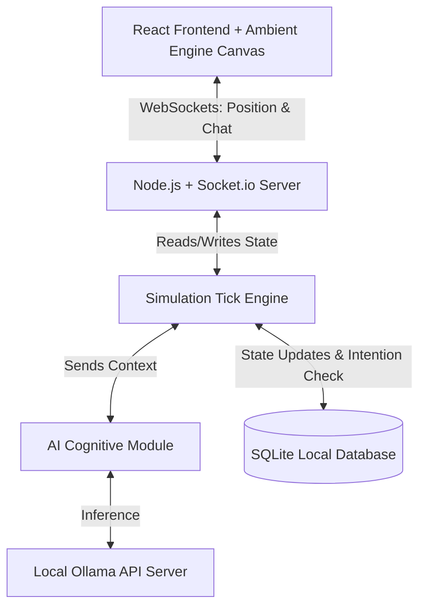

# CivilOS & Ambient Engine Architecture

This document describes the software architecture and component design for **AmbientSpaces v1.0**. The platform decouples simulation execution (rules, ticks, physics) from AI reasoning (intention and conversation).

---

## High-Level Component Flow

---

## Module Specifications

### 1. Client (Ambient Engine & HUD UI)
- **Renderer (`client/src/engine/AmbientEngine.js`)**: Uses HTML5 Canvas context 2D to draw 4 distinct layers:
  - *Layer 1*: Terrain tiles (procedural grass, path details, animated lake wave offsets).
  - *Layer 2*: Collidable structures (walls, trees, table layouts).
  - *Layer 3*: Ground items (wheat, tools, bread).
  - *Layer 4*: Dynamic characters (players & citizens with status bubbles).
- **HUD Inspector (`client/src/components/AIConsole.jsx`)**: Floating React UI panel showing inspected citizen stats, goals, thoughts, relationships, and memories.
- **Networking (`socket.io-client`)**: Syncs position ticks and relays chat feeds.

### 2. Multiplayer Server (`server/server.js`)
- Handles incoming connection requests and manages room mappings.
- Intercepts player coordinate ticks and broadcasts position updates to other clients.
- Runs REST API endpoints for initial asset payloads and map tiles.

### 3. CivilOS (Simulation Engine - `server/civilOS.js`)
- **System Ticker**: Ticks every simulated minute. Tracks global clock and triggers:
  - Energy/hunger decay in citizens.
  - Pathfinding updates (resolving path coordinates towards destination nodes using A*).
  - Economic trades (deducting coins, adding items upon transaction completion).
- **Action Verifier**: Enforces map walls and balance limits. The AI cannot "cheat" by spawning resources; it can only request actions that the simulator verifies and carries out.

### 4. AI Cognitive Engine (`server/aiEngine.js`)
- Translates citizen state into LLM prompts.
- **Cognitive Loop (Observe -> Remember -> Think -> Plan -> Choose Action)**:
  1. *Observe*: Gets citizen parameters and nearby entities.
  2. *Remember*: Queries memories based on relevant interactors.
  3. *Think & Plan*: Builds a system context and queries Ollama.
  4. *Action Selection*: Receives the plan and queues the action in CivilOS.

### 5. Local Database (`server/database/db.js`)
- Structured SQLite database that stores:
  - Map tiles.
  - Citizen parameters and inventories.
  - Relationship metrics (Trust, Love).
  - Interaction logs (Memories).
- Utilizes SQLite for robust local performance and simple single-file deployment.
